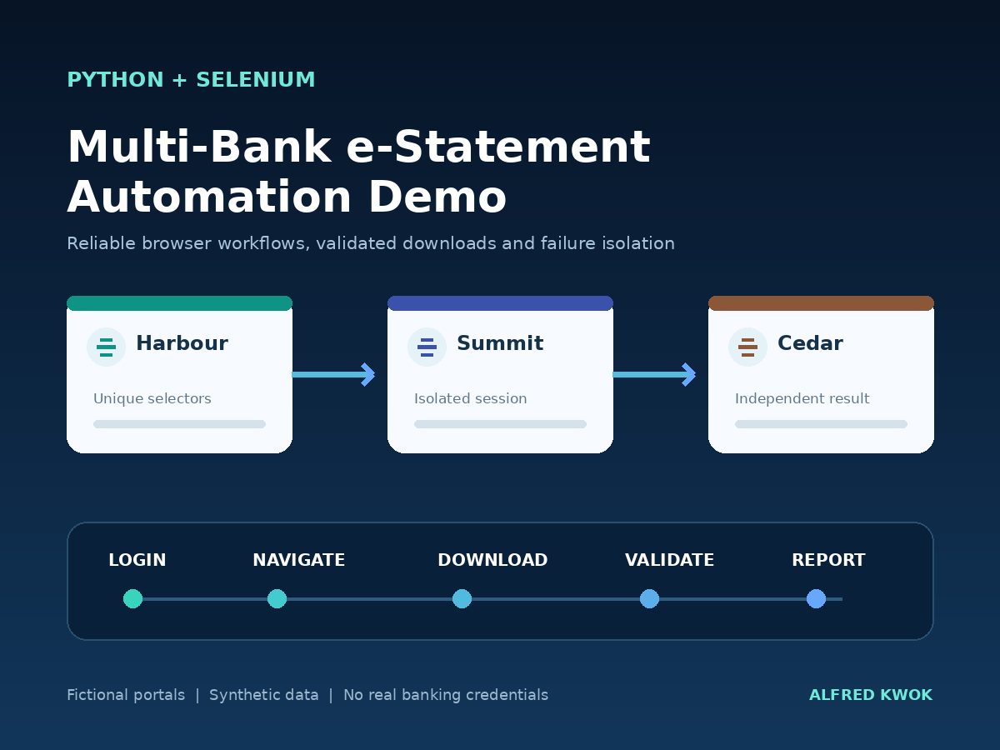

# Multi-Bank e-Statement Automation



A runnable **Python + Selenium portfolio demonstration** of a repetitive finance workflow:

**Open banking portal → log in → open e-Statements → select month → download → validate.**

Three fictional banks (Harbour, Summit and Cedar) have different element IDs, separate sessions and individual downloads. The project uses one Python file with a small configuration layer. A local HTTP server inside that file supplies the demonstration portals automatically.

> This is a newly reconstructed demonstration using synthetic data. It is not the original employer-owned implementation and does not connect to, or claim compatibility with, any real bank. No real credentials, customer records or bank branding are included. It demonstrates workflow engineering, not measured business savings from this demo.

## Quick start

Requirements: Python 3.10+ and Google Chrome. The first run may need internet access so Selenium Manager can resolve the browser driver. Install dependencies before running.

### Windows PowerShell

```powershell
cd selenium-bank-demo
py -m venv .venv
.\.venv\Scripts\python.exe -m pip install -r requirements.txt
Copy-Item .env.example .env
.\.venv\Scripts\python.exe bank_demo.py
```

### macOS / Linux

```bash
cd selenium-bank-demo
python3 -m venv .venv
.venv/bin/python -m pip install -r requirements.txt
cp .env.example .env
.venv/bin/python bank_demo.py
```

A visible Chrome window processes each bank in sequence and closes after its download is verified. Each run writes a new timestamped folder under `output/`, so earlier runs are retained. The default month is August 2026; June and July are also available.

## Useful commands

Use the virtual environment's Python executable in place of `python` below.

```bash
# Default: start mock portals automatically and automate all three banks
python bank_demo.py

# Presentation speed for a screen recording
python bank_demo.py --slow 1.5

# Different statement month / one bank
python bank_demo.py --month 2026-07 --bank summit

# Unattended browser run
python bank_demo.py --headless --slow 0

# Intentionally fail the middle bank: Harbour and Cedar should still succeed
python bank_demo.py --headless --slow 0 --fail-bank summit

# Explore the mock websites manually at http://127.0.0.1:8765
python bank_demo.py --serve --port 8765

# Standard-library HTTP fixture checks (NOT a Selenium browser test)
python bank_demo.py --self-test
```

Automation starts its own server on a free local port; there is no need to run `--serve` first. The server binds only to `127.0.0.1` and stops when the run ends.

## Dummy login details

| Bank | Username | Password |
| --- | --- | --- |
| Harbour Demo Bank | `harbour_demo` | `HarbourDemo123!` |
| Summit Demo Bank | `summit_demo` | `SummitDemo123!` |
| Cedar Demo Bank | `cedar_demo` | `CedarDemo123!` |

The mock server accepts these fixed dummy accounts. `.env` configures the automation client. Changing a client password intentionally causes authentication failure; it does not change the server's accepted account.

## Configuration

`.env.example` includes dummy credentials, `STATEMENT_MONTH`, `HEADLESS`, presentation pacing, timeout and output location. Shell environment variables take priority over `.env`. Command-line arguments take priority over their environment defaults. `.env` and generated output are excluded by `.gitignore`.

Optional `CHROME_BINARY` and `CHROMEDRIVER_PATH` point to an already-installed matching browser and driver for offline or restricted environments. Without these, Selenium Manager handles driver resolution. `--port` selects the mock-server port; by default a free port is used.

## What a client can inspect

- `bank_demo.py`: one-file source; bank-specific selectors in `Bank` configurations, reusable `run_bank` automation, separate local mock-server section.
- `.env.example`: configuration outside the workflow implementation.
- `requirements.txt`: dependency installation; `requirements-tested.txt`: exact direct dependency versions used for validation.
- `sample-output/`: captured execution evidence, when present; see `VALIDATION.md` for the checks actually performed.
- `output/<run>/summary.json`: success/failure for each bank, downloaded filename, row count and SHA-256.
- `output/<run>/run.log`: progress messages without credentials or session cookies.
- `output/<run>/<bank>/`: downloaded CSV plus dashboard and statement-selection screenshots.

## Engineering decisions

**Explicit waits:** the script waits for visible/clickable page elements. `--slow` adds presentation pacing only. Downloads use a bounded polling loop that waits for the expected filename and absence of Chrome partial-download files, then validates the schema, bank, month, row count and complete dummy contents.

**Failure isolation:** each bank has its own browser and download directory. A login, navigation or download failure is reported for that bank while processing continues. Overall exit code is 0 only when all selected banks succeed; a partial failure returns 1.

**Repeatability:** each execution has a separate timestamped output directory. Download validation cannot accidentally pick up a previous run's file. Monthly balances are deterministic: opening 10,000 + receipt 2,500 − supplier 800 − fee 25 = closing HKD 11,675.

**Clear scope:** downloaded statements are CSV files, not PDFs. The fixture uses normal HTML forms and month dropdowns. It does not implement MFA, CAPTCHA, real bank adapters, scheduling, email delivery or cloud hosting. These are separate integration requirements, not features claimed by this sample. There is no login retry loop.

## Suggested 60–90 second client walkthrough

1. Show this README's demonstration disclosure and `.env.example` (dummy data only).
2. Run `python bank_demo.py --slow 1.5` and show the visible browser workflow.
3. Open a downloaded CSV and `summary.json` to show verified outputs.
4. Optionally run `--fail-bank summit` to demonstrate that Cedar is still processed.

Suggested description: “Reconstructed Selenium work sample using three fictional banking portals and synthetic statements. Demonstrates login/navigation automation, per-site selectors, monthly downloads, output validation and failure isolation.”

## Troubleshooting

- **ModuleNotFoundError:** install requirements with the same Python executable used to run the script.
- **NoSuchDriverException / SessionNotCreatedException:** install Chrome and allow Selenium Manager's initial driver download, or set matching `CHROME_BINARY` / `CHROMEDRIVER_PATH` paths.
- **No graphical desktop:** use `--headless`.
- **Login failure:** restore the dummy credentials from `.env.example`; check for shell variables overriding them.
- **Port already used in manual mode:** pick another `--port` or omit it.
- The mock server is a small local demonstration fixture, not an internet-facing authentication system.

## 中文使用摘要

先安裝 Python 及 Chrome，再按上方 Windows 或 macOS 指令執行。程式會自動啟動三間虛構銀行的本機網頁，逐間登入、選擇月份及下載 CSV 月結單。預設使用 dummy 帳戶，無需任何真實銀行資料。`--slow 1.5` 適合錄製示範；`--fail-bank summit` 用來展示一間失敗後仍處理其餘銀行。這是新建作品示範，並非以前公司的原始程式。

## References

- Selenium explicit waits: https://www.selenium.dev/documentation/webdriver/waits/
- Selenium Manager: https://www.selenium.dev/documentation/selenium_manager/
